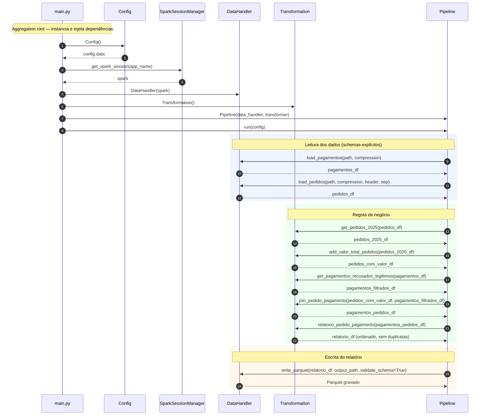

# Análise de Pedidos com Pagamentos Recusados — 2025

**Repositório:** https://github.com/lidiambsouza/auditoria-pedidos-recusados-2025

---

## Descrição e objetivo

Aplicação **PySpark** que gera um relatório, para a alta gestão, dos **pedidos de venda cujos pagamentos foram recusados** (`status = false`) e que, na **avaliação de fraude, foram classificados como legítimos** (`fraude = false`), no período de **2025**.

O projeto foi construído seguindo boas práticas de engenharia de dados: orientação a objetos, injeção de dependências a partir de um *aggregation root* (`main.py`), schemas explícitos, configuração centralizada, logging, tratamento de erros e testes unitários.

### Regras de negócio do relatório

O relatório final contém **exatamente** os seguintes atributos:

1. Identificador do pedido (`id_pedido`)
2. Estado/UF onde o pedido foi feito (`uf`)
3. Forma de pagamento (`forma_pagamento`)
4. Valor total do pedido (`valor_total_pedido` = `valor_unitário × quantidade`)
5. Data do pedido (`data_criacao_pedido`)

Critérios aplicados:

- Apenas pedidos do ano de **2025**;
- Apenas pagamentos **recusados** (`status = false`) e **legítimos** (`fraude = false`);
- Uma linha por pedido (proteção contra duplicatas no join);
- Ordenado por **UF → forma de pagamento → data de criação do pedido**;
- Gravado em formato **Parquet**.

---

## Autores

| Nome | E-mail |
|---|---|
| Lídia M. B. de Souza | lidiambsouza@gmail.com |
| Júlia de Fátima Queiroz | queirozjuliadefatima@gmail.com |
| Victor de Faria | victorfdefariaq@gmail.com |

---

## Pré-requisitos

| Ferramenta | Versão | Observação |
|---|---|---|
| Python | 3.13+ | |
| Java (JDK) | 17 | Exigido pelo Spark 4.x |
| Apache Spark / PySpark | 4.1.1 | Instalado via `pip` |
| Hadoop winutils | 3.3.6 | **Somente Windows** (ver seção de ambiente) |

---

## Configuração do ambiente

### Windows

**1. Criar e ativar o ambiente virtual**

PowerShell:

```powershell
python -m venv venv
venv\Scripts\Activate.ps1
```

Git Bash:

```bash
python -m venv venv
source venv/Scripts/activate
```

**2. Instalar dependências**

```bash
pip install ".[dev]"     # produção + ferramentas de desenvolvimento
# ou apenas produção:
pip install .
```

**3. Configurar o Hadoop winutils (obrigatório no Windows)**

O Spark usa o Hadoop internamente para acessar o sistema de arquivos. No Windows, ele depende de dois binários nativos (`winutils.exe` e `hadoop.dll`); sem eles, o Spark falha ao ler os datasets:

```
Did not find winutils.exe: HADOOP_HOME and hadoop.home.dir are unset.
java.lang.UnsatisfiedLinkError: 'boolean org.apache.hadoop.io.nativeio.NativeIO$Windows.access0(...)'
```

- Crie a pasta `C:\hadoop\bin`;
- Baixe `winutils.exe` e `hadoop.dll` da pasta `hadoop-3.3.6/bin/` do repositório [cdarlint/winutils](https://github.com/cdarlint/winutils) e coloque-os em `C:\hadoop\bin\`;
- Defina as variáveis de ambiente `HADOOP_HOME` e `PATH`:

  **PowerShell (permanente, para o usuário):**

  ```powershell
  [System.Environment]::SetEnvironmentVariable("HADOOP_HOME", "C:\hadoop", "User")
  [System.Environment]::SetEnvironmentVariable("PATH", "C:\hadoop\bin;" + [System.Environment]::GetEnvironmentVariable("PATH","User"), "User")
  ```

  **Git Bash (permanente):** adicione ao arquivo `~/.bashrc` e recarregue:

  ```bash
  echo 'export HADOOP_HOME=/c/hadoop' >> ~/.bashrc
  echo 'export PATH=$HADOOP_HOME/bin:$PATH' >> ~/.bashrc
  source ~/.bashrc
  ```

- Verifique com `winutils.exe ls /`.

### Linux / Mac

**1. Criar e ativar o ambiente virtual**

```bash
python3 -m venv venv
source venv/bin/activate
```

**2. Instalar dependências**

```bash
pip install ".[dev]"     # produção + ferramentas de desenvolvimento
# ou apenas produção:
pip install .
```

> Em Linux/Mac **não** é necessário o winutils — o Hadoop nativo já é suportado.

---

## Datasets

Os datasets de origem são públicos e fornecidos pelo professor:

| Dataset | Repositório | Caminho de origem |
|---|---|---|
| Pagamentos | https://github.com/infobarbosa/dataset-json-pagamentos | `data/pagamentos` (arquivos `*.json.gz`) |
| Pedidos | https://github.com/infobarbosa/datasets-csv-pedidos | `data/pedidos` (arquivos `*.csv.gz`) |

Baixe os arquivos e coloque-os nas pastas de entrada do projeto:

- Pagamentos → `dataset/input/pagamentos/`
- Pedidos → `dataset/input/pedidos/`

Os caminhos, padrões de arquivo e opções de leitura ficam centralizados em `config/settings.yaml`:

```yaml
paths:
  pagamentos: "dataset/input/pagamentos/*.json.gz"
  pedidos: "dataset/input/pedidos/*.csv.gz"
  output: "dataset/output"
```

---

## Execução

> Em todos os sistemas, execute a partir da **raiz do projeto** (`auditoria-pedidos-recusados-2025/`), pois o `settings.py` resolve os caminhos de `dataset/` relativos à raiz.

### Windows / Linux / Mac — direto pelo código-fonte

```bash
spark-submit ./src/main.py
```

### Via wheel empacotado

**1. Gerar o wheel**

```bash
python -m build
```

Isso cria `dist/analise_de_fraude_2025-1.0.0-py3-none-any.whl`.

**2. Instalar e executar**

```bash
pip install dist/analise_de_fraude_2025-1.0.0-py3-none-any.whl
spark-submit ./src/main.py
```

O relatório é gravado em Parquet no caminho de saída definido em `config/settings.yaml`.

---

## Estrutura de pastas

```
auditoria-pedidos-recusados-2025/
├── config/
│   └── settings.yaml           # configurações centralizadas (paths, Spark, opções de leitura)
├── dataset/
│   ├── input/
│   │   ├── pagamentos/         # arquivos *.json.gz
│   │   └── pedidos/            # arquivos *.csv.gz
│   └── output/                 # relatório gerado em Parquet
├── src/
│   ├── config/
│   │   └── settings.py         # classe Config: carrega o YAML e resolve paths absolutos
│   ├── io_utils/
│   │   └── data_handler.py     # classe DataHandler: leitura/escrita (schemas + validação)
│   ├── pipeline/
│   │   └── pipeline.py         # classe Pipeline: orquestra o fluxo completo
│   ├── processing/
│   │   └── transformations.py  # classe Transformation: regras de negócio
│   ├── session/
│   │   └── spark_session.py    # classe SparkSessionManager: criação da SparkSession
│   └── main.py                 # entrypoint / aggregation root, logging
├── tests/
│   └── unit/
│       └── test_transformation.py   # testes unitários da lógica de negócio
├── pyproject.toml
├── requirements.txt
├── MANIFEST.in
└── README.md
```

---

## Tecnologias

- Python 3.13
- PySpark 4.1.1
- PyYAML 6.0.3
- Ruff · Black · Pytest · Coverage

---

## Arquitetura e componentes

O projeto segue **injeção de dependências** a partir do *aggregation root* (`main.py`), onde todas as dependências são instanciadas e injetadas:

| Classe | Pacote | Responsabilidade |
|---|---|---|
| `Config` | `config` | Carrega e centraliza as configurações (`settings.yaml`) |
| `SparkSessionManager` | `session` | Cria e fornece a `SparkSession` |
| `DataHandler` | `io_utils` | Leitura/escrita de dados com schemas explícitos |
| `Transformation` | `processing` | Regras de negócio (filtros, join, relatório) |
| `Pipeline` | `pipeline` | Orquestra a execução de ponta a ponta |

---

## Ferramentas de desenvolvimento

```bash
# linting
ruff check .

# formatação
black src/
```

---

## Execução dos testes e cobertura

Os testes usam **pytest** e cobrem a classe de lógica de negócio (`Transformation`). Ative o ambiente virtual e rode os comandos a partir da **raiz do projeto**.

### Windows (PowerShell)

```powershell
venv\Scripts\Activate.ps1
pytest
pytest --cov=processing.transformations --cov-report=term-missing
```

### Windows (Git Bash)

```bash
source venv/Scripts/activate
pytest
pytest --cov=processing.transformations --cov-report=term-missing
```

### Linux / Mac

```bash
source venv/bin/activate
pytest
pytest --cov=processing.transformations --cov-report=term-missing
```

Resultado esperado: **20 testes aprovados** e **100% de cobertura** em `transformations.py`:

```
============================= 20 passed =============================
Name                                Stmts   Miss  Cover
src\processing\transformations.py      41      0   100%
```

---

## Testes no Windows — leitura via JSON em vez de `createDataFrame`

No Windows, o worker Python do PySpark 4.1.1 crasha (`WinError 10038` ao fechar o socket de comunicação com a JVM) sempre que dados locais precisam voltar pela ponte Python↔JVM — exatamente o que `spark.createDataFrame(lista).collect()` faz:

```
org.apache.spark.SparkException: Python worker exited unexpectedly (crashed)
Caused by: java.io.EOFException
```

O problema **não é dos testes nem da versão do Python** (reproduzido em 3.13 e 3.14, fora do pytest). É uma limitação do worker do PySpark 4.x no Windows. Operações nativas da JVM — como `spark.range(...)` e **leitura de arquivos** (`spark.read`) — não passam por esse worker e funcionam normalmente.

Por isso os testes constroem os DataFrames de entrada lendo de um arquivo JSON temporário, em vez de `createDataFrame`:

```python
def make_df(spark, data, schema, tmp_path):
    """Cria um DataFrame a partir de dados locais via arquivo JSON temporário."""
    path = tmp_path / f"{uuid.uuid4().hex}.json"
    with open(path, "w", encoding="utf-8") as f:
        for row in data:
            f.write(json.dumps(_to_json_record(row, schema)) + "\n")
    return spark.read.schema(schema).json(str(path))
```

Esse caminho roda 100% na JVM, preserva todos os tipos (inclusive o struct aninhado `avaliacao_fraude`) e funciona em **qualquer ambiente** (Windows, Linux, Mac, CI). O pipeline de produção nunca foi afetado, pois ele também lê de arquivos (CSV/JSON).

> Em Linux/Mac o `createDataFrame` funciona normalmente; a abordagem via JSON é mantida por ser portável e não ter desvantagem.

---

## Diagrama de sequência

Fluxo de execução do pipeline, do `main.py` (aggregation root) até a gravação do relatório em Parquet:


